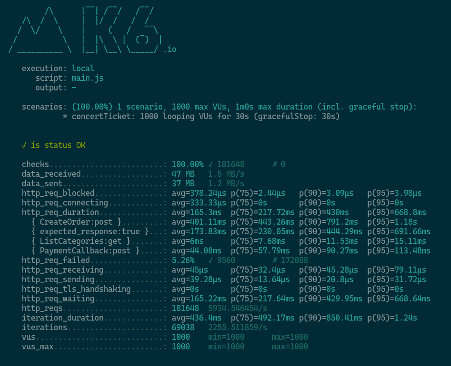

# Concert Ticket Backend

This is a backend for a concert ticket booking system. It is built using Go, Postgres, and Redis.

## Getting Started

## Architecture


1. Cron

   The cron will set cache for list of categories every 3 seconds.

2. HTTP

   The HTTP server will handle the following functionalities:
    - Get list of categories by cache.
    - Create order, and call payment gateway to get Virtual Account number.
    - Listen to payment gateway callback to update order status.

3. Task Queue

   The task queue will handle order cancellation if the payment is not made within certain time.

### Prerequisites

1. Docker
2. Go 1.22 or later

### Installation

1. Clone this repository.
2. Run `docker-compose up -d` to start the required tool container.
3. Adjust your configuration in `config` directory.
4. Run this code to start the server:

```bash
$ go mod tidy
$ go build .
$ ./concert-ticket serve-all
```

If you want to run the server **without payment gateway (recommended)** integration, use `-tags loadtest`, example:

```bash
$ go build -tags loadtest .
```

5. The server will run on `localhost:8080`.
6. Initialize migration schema from `deploy/sql` directory.
7. Seed the database from `deploy/csv` directory.
8. Server is ready to use.

### Features

1. Order tickets for a concert maximum of 1 ticket per user.
2. Payment gateway integration using Midtrans.
3. Observability using Log Slog and Tracing OpenTelemetry.

### Flow

1. User choose seat category.
2. User order ticket and input their email.
3. User will receive Virtual Account number.
4. User make payment using the Virtual Account number.
5. Order status will be updated to paid if payment is successful.

## Load Testing

Load testing is done using [k6](https://k6.io/). The test script is located in `loadtest` directory.

### Running Load Test

1. Install k6.
2. Run `k6 run loadtest/main.js`.
3. The test will run for 30 seconds.
4. The test result will be displayed in the terminal.

### Specification

1. App : AWS EC2 C7G.4xlarge 16 Core CPU, 32GB RAM
2. Test Generator : AWS EC2 T3.2xlarge 8 Core CPU, 32GB RAM

### Scenario

1. Get list of categories
2. Create order
3. If concurrent_user_id % 4 != 0, pay order, else not (cancel order)

### Result

| Concurrent user (Vu) | RPS  | Error | Avg   | P(75) | P(90) | P(95) |
|----------------------|------|-------|-------|-------|-------|-------|
| 1000                 | 5934 | 0%    | 165ms | 217ms | 430ms | 668ms |
| 2000                 | 3982 | 0%    | 480ms | 364ms | 1,1s  | 2,3s  |

1. 1000 user
   
2. 2000 user
   

## Observability

### Logging

View logs in stdout, `Todo: stream log to Grafana`.

### Tracing

View traces in Jaeger UI at `localhost:16686`